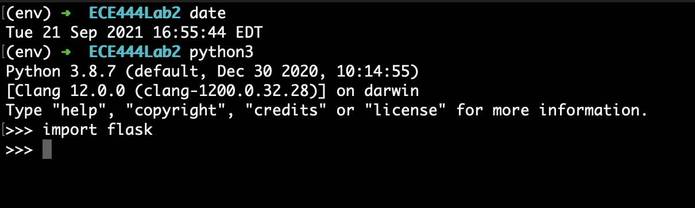

# ECE444-F2021-Lab2
Lab 2 for ECE444 Fall 2021

This repo is a clone of https://github.com/miguelgrinberg/flasky.

## Development
*Note: Set the `SECRET_KEY` environment variable to run this application.*

## Screenshots for Lab Submission
### Activity 1

### Activity 2

### Activity 3

### Activity 4
1. 
2. 
3. 
4. 